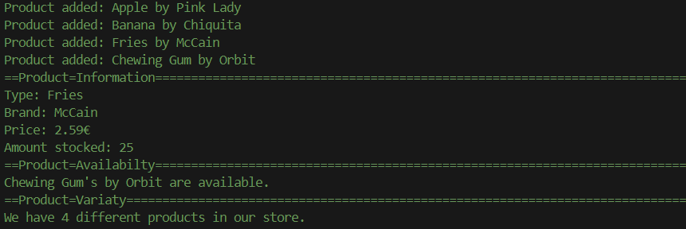
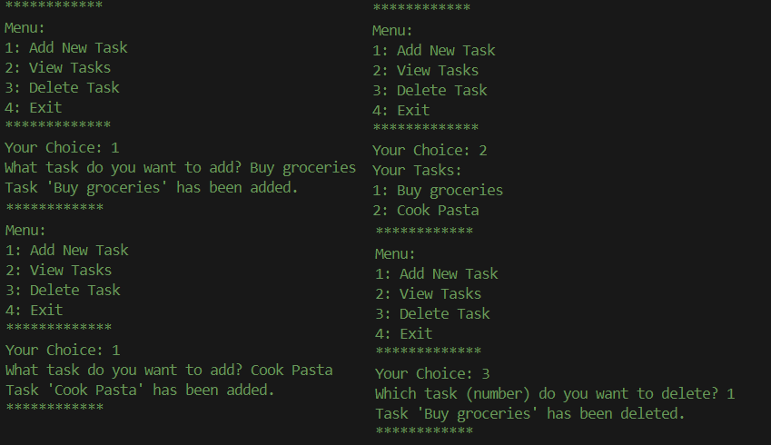

# Exercises

A repository containing exercises to track continuous improvements in programming. 

---

## Topics

### **01_Basics**
- `HelloWorld.py`: A simple script used to test GitHub settings and print "Hello, World!"
- `ArithmeticOperators.py`: Explanation and demonstration of arithmetic operators
- `Variables.py`: What is a variable, how do I use it?
  - Assigning values to variables of different data types (strings, integers, floats, booleans).
  - Reassigning variables and changing their values or types throughout the code.
  - Assigning multiple variables in one line.
  - Checking the type of a variable using `type()`.
- `Input_TypeConversion`: Working with user input and converting data types.
  - `input()` function for user interaction.
  - Converting data types using `int()`, `float()`, and `str()`.
### **02_Control_Structures**
- `Loops.py`: Basic introduction into loops
  - `while` loops for conditional execution.
  - `for` loops for iterating over sequences.
  - Examples including skipping iterations, breaking out of loops, and reverse looping.

### **03_Functions**
- `Basics.py`: Examples showcasing:
  - Defining a simple function.
  - Using parameters to pass values.
  - Returning values from functions.
  - Getting user input and performing calculations.
  - 
### **04_Data_Structures**
- `Collections.py`: Explaination and examples of collection types.
  - Lists
  - Sets
  - Tuples
- `Dictionaries.py`: a special type of collection with key-value pairs.
  - Adding, updating and removing pairs
  - Accessing pairs
  - Iterating over dictionaries
### **05_Modules**
- `01_BuiltInModules/Math.py`: Exploring Python's `math` module
  - Common mathematical functions like `sqrt()`, `pow()`, `ceil()`, and `floor()`.
  - Recreating those functions manually

### **06_OOP_Basics**
- `01_Objects/`: Introduction to object-oriented programming
  - `main.py`: examples and executions of the product class
  - `product.py`: Defining the `Product` class -> a blueprint for creating objects (Products) with attributes and methods.
  - 
  
### **07_Projects**
- `ShoppingList.py`: A shopping list program where you can:
  - Add, view, and remove products.
  - Calculate the total cost.
  - Track the quantity and price of each items.
  - 
- `ToDoList.py`: A To-do-list where you can:
  - Create and add tasks to a list
  - Display the list
  - Remove items
  - 

### **08_Algorithms**
- `BubbleSort.py`: A simple algorithm to sort a list of values by comparing and swapping neighbors. 
---

## Goals

- **Practice programming concepts**
- **Track progress**
---
