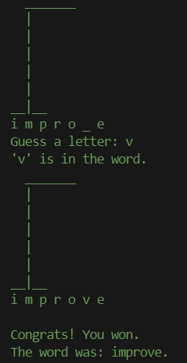

# Exercises

*Under construction*  
Hello and welcome to my Python beginners course. 🐍  
In this repository, you will find a variety of **code examples**, **projects**, **exercises**, and **informative insights** in each script.  
The goal is to build a **free, high-quality,** and **easy-to-understand tutorial**.  
*In the future, I plan to create a detailed script that further deepens the theoretical content.*

---

## Topics

### **01_Basics**
- `HelloWorld.py`: A simple script used to test GitHub settings and print "Hello, World!"
- `ArithmeticOperators.py`: Explanation and demonstration of arithmetic operators
- `Variables.py`: What is a variable, how do I use it?
  - Assigning values to variables of different data types (strings, integers, floats, booleans)
  - Reassigning variables and changing their values or types throughout the code
  - Assigning multiple variables in one line
  - Checking the type of a variable using `type()`.
- `Input_TypeConversion`: Working with user input and converting data types
  - `input()` function for user interaction
  - Converting data types using `int()`, `float()`, and `str()`.
- `StringOperations.py`: String functions explained
  - Creating and indexing strings
  - Combining (concatenating), converting, and formatting strings
  - `text[::4]`, `.lower()`, `.upper()`, `.replace()`, `.split()`, `"-".join()`, `f"{variable}"`, `.format()`
  
### **02_Control_Structures**
- `Loops.py`: Basic introduction into loops
  - `while` loops for conditional execution
  - `for` loops for iterating over sequences
  - Examples including skipping iterations, breaking out of loops, and reverse looping
- `NestedLoops.py`: Understanding the logic behind it and be able to apply it in practice
  - Printing a square pattern
  - Iterating over a shopping cart (list of dictionaries)
  - Creating a multiplication table (2d matrix)
- `ErrorHandling.py`: Basics of error handling in Python
  - Using `try`, `except`, `else`, and `finally`
  - Handling `ValueError` and `ZeroDivisionError`

### **03_Functions**
- `Basics.py`: Examples showcasing:
  - Defining a simple function
  - Using parameters to pass values
  - Returning values from functions
  - Getting user input and performing calculations
  - 
### **04_Data_Structures**
- `Collections.py`: Explaination and examples of collection types
  - Lists
  - Sets
  - Tuples
- `Dictionaries.py`: A special type of collection with key-value pairs
  - Adding, updating and removing pairs
  - Accessing pairs
  - Iterating over dictionaries
- `ListComprehensions.py`: Compact way to create and manipulate lists
  - Basic syntax: `[EXPRESSION for ITEM in ITERABLE]`
  - `if` and `if-else` list comprehensions

### **05_Modules**
- `01_BuiltInModules/Math.py`: Exploring Python's `math` module
  - Common mathematical functions like `sqrt()`, `pow()`, `ceil()`, and `floor()`
  - Recreating those functions manually
- `01_BuiltInModules/Random.py`: Exploring Python's `random` module
  - Generating random numbers, shuffling sequences and making random choices 
  - Typically used functions like `randint()`, `shuffle()`, `choices()`, and `randrange()`
- `02_CustomModules/Supermarket.py`: Creating our own supermarket module!
  - Defining own functions in our module `calculate_total_price()` and `greet_customer()`
  - Using Docstrings 
  - Using `main.py` to import and use those
### **06_OOP_Basics**
- `01_Objects/`: Introduction to object-oriented programming
  - `main.py`: examples and executions of the product class
  - `product.py`: Defining the `Product` class -> a blueprint for creating objects (Products) with attributes and methods.
  - 
  
### **07_Projects**
- `ShoppingList.py`: A shopping list program where you can:
  - Add, view, and remove products
  - Calculate the total cost
  - Track the quantity and price of each items
  - 
- `ToDoList.py`: A To-do-list where you can:
  - Create and add tasks to a list
  - Display the list
  - Remove items
  - 
- `Hangman.py`: A python version of the classic hangman game:
  - `Visuals.py` displaying ASCII art for the console
  - with 100 random words
  - 

### **08_Algorithms**
- `BubbleSort.py`: A simple algorithm to sort a list of values by comparing and swapping neighbors. 
<<<<<<< HEAD
- `InsertionSort.py`: Builds sorted list each element at a time by inserting into the correct position.
=======

## Quick Start
1. **Clone the repository**:
   ```bash
   git clone https://github.com/fl97-mo/exercises.git
2. **Navigate to the directory and run a script**:
   ```bash
   cd exercises
   ```
   ```bash
   python 01_Basics/HelloWorld.py
