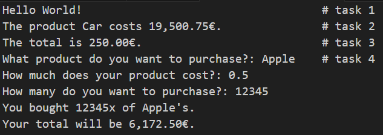

# Exercises

A repository containing exercises to track continuous improvements in programming. 

---

## Topics

### **01_Basics**
- `HelloWorld.py`: A simple script used to test GitHub settings and print "Hello, World!"
### **02_Control_Structures**
- TBC

### **03_Functions**
- `Basics.py`: Beginner-friendly examples showcasing:
  - Defining a simple function.
  - Using parameters to pass values.
  - Returning values from functions.
  - Getting user input and performing calculations.
  - 
### **04_Data_Structures**
- TBC

### **05_Modules**
- TBC

### **06_OOP_Basics**
- TBC

### **07_Projects**
- `ShoppingList.py`: A fully functional shopping list program where you can:
  - Add, view, and remove products.
  - Calculate the total cost.
  - Track the quantity and price of each items.
  - 

---

## Goals

- **Practice programming concepts**
- **Track progress**
---
